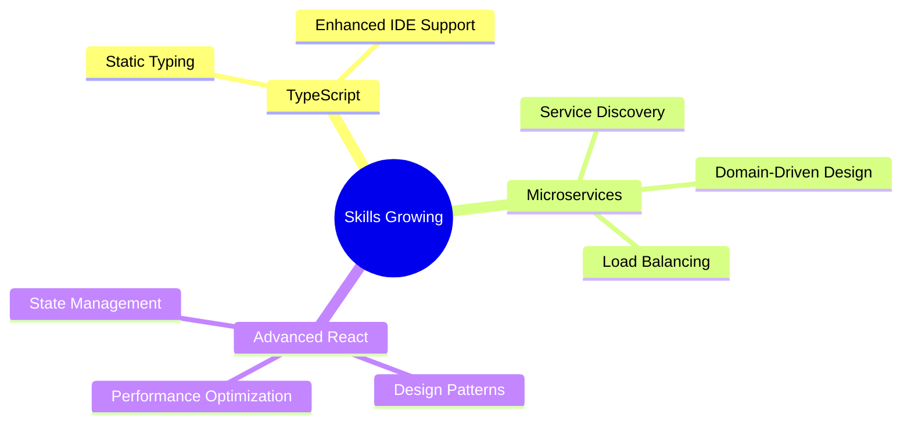

  

  

## 🚀 About Me
> A passionate developer crafting digital solutions with a unique blend of web development and industrial automation expertise. I believe in writing clean code and building user-centric applications that make a difference.

## 🛠️ Tech Arsenal

  
| Category | Technologies |
|----------|:-------------:|
| **Languages** |    |
| **Frontend** |    |
| **Backend** |   |
| **Database** |   |
| **Tools** |    |

## 📈 GitHub Analytics

  

  
  

## 🌱 Learning & Growing

## 🎯 Featured Projects

## 🤝 Connect With Me

  

### 🎵 Spotify Playing

---

  
### 💡 Random Dev Quote

