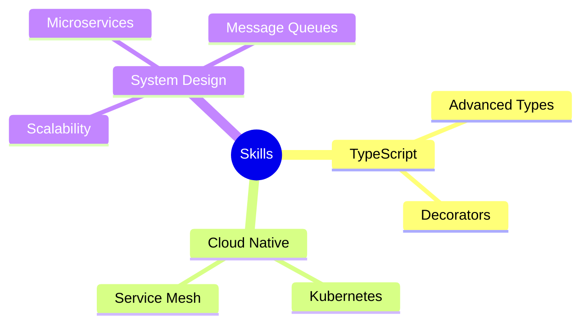

<div align="center">


<div style="display: inline-block;">
  
  
</div>


</div>

<div align="center">
  
[](https://github.com/arjunmb)
[](https://badges.pufler.dev)
[](https://badges.pufler.dev)
[](https://badges.pufler.dev)
  
</div>


## 💫 About Me

```javascript
class Developer {
    constructor() {
        this.name = "Arjun M B";
        this.role = "Full Stack Developer";
        this.languageSpoken = ["en_US", "hi_IN"];
        this.codeBase = ["JavaScript", "Python", "C", "SQL"];
        this.challenge = "Learning something new everyday";
    }

    sayHi() {
        console.log("Thanks for dropping by! Let's build something amazing together!");
    }
}

const me = new Developer();
me.sayHi();
```

## 🚀 Skills & Technologies

<div align="center">
<details open>
<summary><b>🎯 Frontend Development</b></summary>
<br>


</details>

<details open>
<summary><b>⚡ Backend Development</b></summary>
<br>


</details>

<details open>
<summary><b>🛠 DevOps & Tools</b></summary>
<br>


</details>
</div>

## 📊 GitHub Analytics

<div align="center">


</div>

## 🏆 GitHub Achievements

<p align="center">

</p>

## 🌱 Current Learning Path

<div align="center">



</div>

## 🎯 Featured Projects

<div align="center">
<a href="https://github.com/arjunmb/project1">
  
</a>
<a href="https://github.com/arjunmb/project2">
  
</a>
</div>

## 🤝 Let's Connect

<div align="center">

[](https://linkedin.com/in/arjunmb)
[](https://twitter.com/arjunmb)
[](https://arjunmb.com)
[](mailto:your.email@gmail.com)

</div>

## 🎵 Vibing To
<div align="center">

[](https://spotify-github-profile.vercel.app/api/view?uid=YOUR_SPOTIFY_ID&redirect=true)


</div>

<div align="center">

### 💡 A Random Dev Quote


</div>


