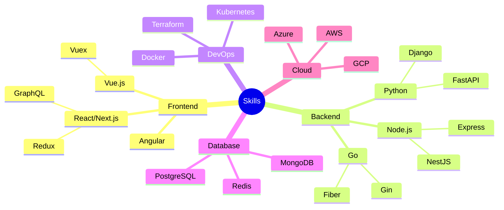
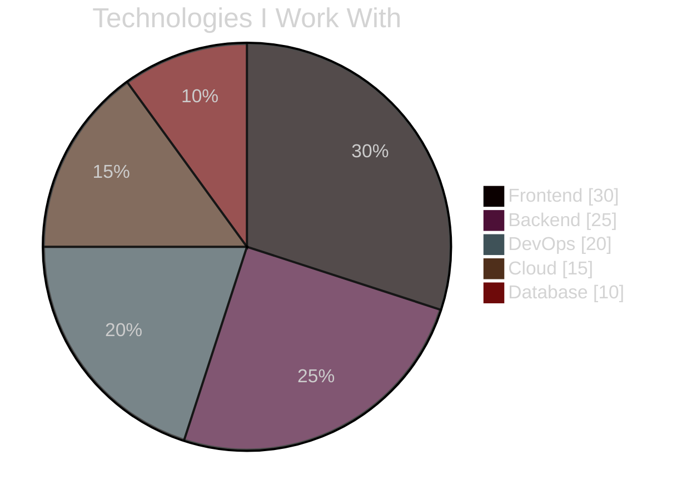

<!-- ANIMATED TERMINAL HEADER -->
<div align="center">
   

   <!-- ANIMATED CONSOLE -->
   ```console
   root@arjunmb:~# ./initialize_profile.sh
   [■■■■■■■■■■■■■■■■■■■■] 100%
   Successfully loaded developer profile!
   ```

   <!-- ANIMATED TYPEWRITER -->
   <a href="https://git.io/typing-svg">
      
   </a>
</div>

<!-- 3D CONTRIBUTION ANIMATION -->


<!-- ANIMATED WAVES -->


<!-- MATRIX CODE ANIMATION -->
<div align="center">
   
</div>

<!-- ANIMATED SKILL TREE -->
<h2>
   
   Technical Universe
</h2>



<!-- ANIMATED TECH STACK -->
<div align="center">
   
   
</div>

<!-- LIVE CODING ANIMATION -->
<div align="center">
   
</div>

<!-- ANIMATED STATS WITH NEW COLOR SCHEME -->
<div align="center">
   
   
</div>

<!-- ANIMATED ACTIVITY GRAPH -->


<!-- INTERACTIVE PROJECTS SHOWCASE -->
<h2>
   
   Featured Projects
</h2>

<div align="center" style="display: flex; gap: 10px;">
   <!-- PROJECT CARDS WITH HOVER ANIMATION -->
   <a href="https://github.com/arjunmb/project1">
      
   </a>
   <a href="https://github.com/arjunmb/project2">
      
   </a>
</div>

<!-- TECH RADAR VISUALIZATION -->
<h2>
   
   Technology Radar
</h2>



<!-- ANIMATED CODING METRICS -->
<div align="center">
   
   
</div>

<!-- INTERACTIVE SOCIAL LINKS -->
<h2>
   
   Connect with Me
</h2>

<div align="center">
   <!-- ANIMATED SOCIAL ICONS -->
   <a href="https://linkedin.com/in/arjunmb"></a>
   <a href="https://twitter.com/arjunmb"></a>
   <a href="https://github.com/arjunmb"></a>
   <a href="mailto:your.email@gmail.com"></a>
</div>

<!-- SPOTIFY INTEGRATION WITH ANIMATION -->
<div align="center">
   
</div>

<!-- ANIMATED WAVES FOOTER -->


<!-- PROFILE VIEWS COUNTER -->
<div align="center">
   
</div>
