<div align="center">


<div style="display: inline-block;">
  <a href="https://git.io/typing-svg">
    
  </a>
  
</div>

<!-- Contribution Snake Animation -->
<picture>
  <source media="(prefers-color-scheme: dark)" srcset="https://raw.githubusercontent.com/arjunmb/arjunmb/output/github-contribution-grid-snake-dark.svg">
  <source media="(prefers-color-scheme: light)" srcset="https://raw.githubusercontent.com/arjunmb/arjunmb/output/github-contribution-grid-snake.svg">
  
</picture>

<div align="center">
  
[](https://github.com/arjunmb)
[](https://badges.pufler.dev)
[](https://badges.pufler.dev)
[](https://badges.pufler.dev)
  
</div>


## 💫 About Me

```typescript
interface ISkillSet {
    languages: string[];
    frameworks: string[];
    databases: string[];
    tools: string[];
}

class Developer {
    private name: string;
    private title: string;
    private location: string;
    private skills: ISkillSet;

    constructor() {
        this.name = "Arjun M B";
        this.title = "Full Stack Developer";
        this.location = "🌍 Available for Remote Work";
        this.skills = {
            languages: ["JavaScript", "TypeScript", "Python", "SQL"],
            frameworks: ["React", "Node.js", "Express", "Next.js"],
            databases: ["MongoDB", "PostgreSQL", "Redis"],
            tools: ["Docker", "AWS", "Git", "Linux"]
        };
    }

    public sayHi(): void {
        console.log(`
            🚀 Welcome to my GitHub! 
            💻 Let's build something extraordinary together!
            📫 Reach out: your.email@gmail.com
        `);
    }

    public getCurrentChallenges(): string[] {
        return [
            "Mastering System Design",
            "Building Scalable Microservices",
            "Contributing to Open Source"
        ];
    }
}

// Initialize Developer
const arjun = new Developer();
arjun.sayHi();
```

## 🎯 Skills & Expertise

<div align="center">
<details open>
<summary><b>📱 Frontend Mastery</b></summary>
<br>


</details>

<details open>
<summary><b>⚙️ Backend Arsenal</b></summary>
<br>


</details>

<details open>
<summary><b>🛠️ DevOps & Cloud</b></summary>
<br>


</details>
</div>

## 📊 GitHub Metrics

<div align="center">
  
  
</div>

<div align="center">
  
  
</div>

## 🌱 Learning Roadmap

```mermaid
mindmap
  root((2024 Goals))
    Cloud Native
      Kubernetes 🎯
      Service Mesh
      GitOps
    Architecture
      System Design
      Event-Driven
      Microservices
    AI/ML
      TensorFlow
      PyTorch
      MLOps
    Web3
      Smart Contracts
      DeFi
      dApps
```

<div align="center">



</div>

## 🔥 Featured Projects

<div align="center">
<a href="https://github.com/arjunmb/project1">
  
</a>
<a href="https://github.com/arjunmb/project2">
  
</a>
</div>

## 🤝 Let's Connect

<div align="center">

[](https://linkedin.com/in/arjunmb)
[](https://twitter.com/arjunmb)
[](https://arjunmb.com)
[](mailto:your.email@gmail.com)
[](https://github.com/arjunmb)

</div>

## 🎵 Currently Vibing To

<div align="center">

[](https://spotify-github-profile.vercel.app/api/view?uid=YOUR_SPOTIFY_ID&redirect=true)


</div>

<div align="center">

### 💭 Random Dev Quote


</div>

<!-- Footer Wave -->

